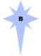
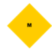

<div align="right"><a href="https://github.com/Game-in-the-Brain"></a></div>

# Mneme CE World Generator — Function Requirements Document (FRD)

**Version 1.4** | **Date:** 2026-04-10  
**Project:** Mneme CE World Generator PWA (Cepheus Engine variant)  
**GitHub Repository:** [github.com/Game-in-the-Brain/Mneme-CE-World-Generator](https://github.com/Game-in-the-Brain/Mneme-CE-World-Generator)  
**Book Series:** [DriveThruRPG — Game in the Brain](https://www.drivethrurpg.com/en/publisher/17858/game-in-the-brain)

> ⚠️ **Known Issues:** See [QA.md](./QA.md) for the full list of open bugs and feature gaps.

---

## Table of Contents

1. [Executive Summary](#1-executive-summary)
2. [Design Decisions](#2-design-decisions)
3. [Visual Design Specification](#3-visual-design-specification)
4. [Core Dice Engine](#4-core-dice-engine)
5. [Star Generation Module](#5-star-generation-module)
6. [Main World Generation Module](#6-main-world-generation-module)
7. [Inhabitant Generation Module](#7-inhabitant-generation-module)
8. [Planetary System Generation Module](#8-planetary-system-generation-module)
   - 8.6 Orbital Placement — Hill Sphere Spacing
9. [Data Model](#9-data-model)
10. [UI Components](#10-ui-components)
11. [Data Management](#11-data-management)
12. [PWA Features](#12-pwa-features)
13. [Milestone Plan](#13-milestone-plan)
14. [Reference Documents](#14-reference-documents)

---

## 1. Executive Summary

The MNEME World Generator PWA is a Progressive Web App that replicates and enhances the Google Sheets-based world generation system for the Mneme variant of the Cepheus Engine RPG. It generates complete solar systems including stars, worlds, inhabitants, and planetary bodies using dice-based procedural generation.

---

## 2. Design Decisions

| # | Decision | Status |
|---|----------|--------|
| 1 | Culture Table (D66 × D6) included | ✅ YES |
| 2 | Travel Zone determination (Amber/Red) | ✅ YES |
| 3 | Starport base generation (Naval/Scout/Pirate) | ✅ YES |
| 4 | Visual Theme | ✅ Dark sci-fi with red accent (Cepheus/Traveller), toggle to day theme |
| 5 | Dice Animation | ❌ NO - rolls displayed clearly but not animated |
| 6 | Phone theme (vertical single-column layout) | ✅ YES — see [QA-005](./QA.md#qa-005) |
| 7 | Single-page layout with tab anchors (not multi-page routes) | ✅ YES — see [QA-010](./QA.md#qa-010) |
| 8 | Logo in top-right linking to GitHub | ✅ YES — see [QA-002](./QA.md#qa-002) |

---

## 3. Visual Design Specification

### 3.1 Color Palette (Default/Dark Theme)

| Element | Color | Hex |
|---------|-------|-----|
| Background | Deep Space Black | `#0a0a0f` |
| Card Background | Panel Gray | `#141419` |
| Primary Accent | Traveller Red | `#e53935` |
| Secondary Accent | Star White | `#f5f5f5` |
| Text Primary | Off White | `#e0e0e0` |
| Text Secondary | Dim Gray | `#9e9e9e` |
| Success | Habitable Green | `#4caf50` |
| Warning | Amber Zone | `#ff9800` |
| Danger | Red Zone | `#f44336` |
| Star O | Blue White | `#a8d8ff` |
| Star B | Blue | `#6bb6ff` |
| Star A | White | `#ffffff` |
| Star F | Yellow White | `#fff8e1` |
| Star G | Yellow | `#ffecb3` |
| Star K | Orange | `#ffcc80` |
| Star M | Red | `#ff8a65` |

### 3.3 Phone Theme

A third theme optimised for narrow portrait screens.

| Behaviour | Rule |
|-----------|------|
| Layout | Single column, full width |
| Cards | Stack vertically, no side-by-side panels |
| Touch targets | Minimum 44px height for all interactive elements |
| Hidden elements | Collapse non-essential sidebars and decorative zone diagrams |
| Font size | Base 16px (no smaller) |
| Tab bar | Fixed to bottom of screen |

**Theme key:** `"phone"` — stored in localStorage alongside `"dark"` / `"day"`.

> ✅ **QA-005:** Phone theme implemented. [See QA-005](./QA.md#qa-005)

---

### 3.4 Theme Toggle UI

To conserve header space, the Dark/Day theme buttons occupy the same position (toggle), with Phone as a separate button.

| State | Icon | Click Action |
|-------|------|--------------|
| Dark mode | ☾ Moon | Switch to Day |
| Day mode | ☀ Sun | Switch to Dark |
| Phone mode | ▢ Smartphone | Return to previous desktop theme |

**Behaviour:**
- Only two buttons visible at any time (Day/Dark toggle + Phone)
- Phone button highlighted red when active
- Previous desktop theme remembered when switching to/from Phone

> ✅ **QA-013:** Compact theme toggle implemented. [See QA-013](./QA.md#qa-013)

---

### 3.2 Day Theme Palette

| Element | Color | Hex |
|---------|-------|-----|
| Background | Light Gray | `#f5f5f5` |
| Card Background | White | `#ffffff` |
| Primary Accent | Traveller Red | `#c62828` |
| Text Primary | Dark Gray | `#212121` |

---

## 4. Core Dice Engine

### 4.1 Basic Rolls

| Function | Signature | Description |
|----------|-----------|-------------|
| `rollD6()` | `() => number` | Returns 1-6 |
| `rollD66()` | `() => number` | Returns 11-66 (two D6s as digits) |
| `rollXD6(x)` | `(count: number) => number[]` | Returns array of X D6 rolls |

### 4.2 Advanced Rolls

| Function | Signature | Description |
|----------|-----------|-------------|
| `rollKeep()` | `(diceRolls, diceType, keepSize, keepType, modifier) => number` | Roll N dice, keep M highest/lowest |
| `rollExploding()` | `(diceRolls, diceType, multiplier, modifier) => number` | Exploding dice (reroll on max) |

### 4.3 Dice Notation Mapping

| Notation | Implementation |
|----------|----------------|
| `2D6` | `rollKeep(2, 6, 2, 1, 0)` |
| `2D6 Adv+1` | `rollKeep(3, 6, 2, 1, 0)` |
| `2D6 Adv+2` | `rollKeep(4, 6, 2, 1, 0)` |
| `2D6 Dis+1` | `rollKeep(3, 6, 2, 0, 0)` |
| `2D6 Dis+2` | `rollKeep(4, 6, 2, 0, 0)` |
| `5D6` | `rollKeep(5, 6, 5, 1, 0)` |
| `3D6` | `rollKeep(3, 6, 3, 1, 0)` |
| `2D3` | `rollKeep(2, 3, 2, 1, 0)` |
| `1D6 reroll 6` | Roll until result ≠ 6 |

### 4.4 Roll Display (Non-Animated)

All rolls must be clearly displayed in the UI:
- Show the dice notation used
- Show individual die results
- Show final calculated value
- Show any modifiers applied

---

## 5. Star Generation Module

### 5.1 Primary Star Generation

| Function | Input | Output | Table |
|----------|-------|--------|-------|
| `generatePrimaryStar()` | None | `{ class, grade, mass, luminosity }` | [REF-001: Stellar Tables](./references/REF-001-stellar-tables.md) |

#### Stellar Classification Visual Reference

The seven stellar classes span from rare, extremely hot blue-white giants down to the ubiquitous cool red dwarfs. The icon for each class is shown below — colour and shape encode the spectral class at a glance.

| Class | Icon | Colour | Temp (K) | Typical Luminosity | Habitability Notes |
|-------|------|--------|----------|--------------------|--------------------|
| O |  | Pale violet / blue-white | > 30,000 | 10⁵ – 10⁶ L☉ | Intense UV — disks only; no stable habitable zone |
| B |  | Light blue | 10,000 – 30,000 | 10² – 10⁵ L☉ | Very short-lived; disks only |
| A |  | Blue-white / white | 7,500 – 10,000 | 5 – 100 L☉ | Disks only; short stellar lifetime |
| F |  | Yellow-white | 6,000 – 7,500 | 1.5 – 5 L☉ | Habitable zone possible; Adv+2 on planet count |
| G |  | Yellow (Sun-like) | 5,200 – 6,000 | 0.6 – 1.5 L☉ | Optimal for life; baseline (no modifier) |
| K |  | Yellow-orange | 3,700 – 5,200 | 0.1 – 0.6 L☉ | Tidally locked worlds possible; Dis+2 on planet count |
| M |  | Orange-red | < 3,700 | < 0.1 L☉ | Common; narrow habitable zone; Dis+4 on planet count |

> **UI:** The full spectrum strip (all 7 classes left-to-right, O → M) is displayed as a persistent reference row on the Star section. The primary star's class is highlighted. Individual class images are at `public/references/Class-[X]-star.png`.
>
> ✅ **QA-003:** Star classification images surfaced in UI. [See QA-003](./QA.md#qa-003)

### 5.2 Zone Calculation

| Function | Formula |
|----------|---------|
| `calculateZones(luminosity)` | Returns zone boundaries |

**Zone Boundaries (based on √L☉):**

| Zone | Formula |
|------|---------|
| Infernal | 0 to <(√L☉ × 0.4) |
| Hot | (√L☉ × 0.4) to <(√L☉ × 0.8) |
| Conservative Habitable | (√L☉ × 0.8) to <(√L☉ × 1.2) |
| Cold (= Optimistic Habitable) | (√L☉ × 1.2) to <(√L☉ × 4.85) |
| Outer Solar System | ≥(√L☉ × 4.85) |

### 5.3 Companion Star Generation

See [REF-002: Companion Star Logic](./references/REF-002-companion-star.md) for detailed implementation.

#### Step 1: Existence Check

Roll 2D6 vs target based on **previous star's** class (chain rule):

| Previous Class | Target |
|----------------|--------|
| O | 4+ |
| B | 5+ |
| A | 6+ |
| F | 7+ |
| G | 8+ |
| K | 9+ |
| M | 10+ |

- Roll ≥ target: Companion exists
- Roll = 12: Companion exists AND attempt an additional companion roll (vs this companion's class, not the primary)

#### Step 2: Roll Class and Grade

- Roll 5D6 for class (same table as primary)
- Roll 5D6 for grade (same table as primary)

#### Step 3: Apply Constraints (No Loops)

**Class Constraint:**
- Class rank: O=7, B=6, A=5, F=4, G=3, K=2, M=1
- If rolled rank > previous rank:
  ```
  scaledRank = round(rolledRank × (previousRank / 7))
  constrainedClass = rankToClass(scaledRank)
  ```

**Grade Constraint:**
- Grade 0 = most luminous, Grade 9 = least luminous
- If rolled grade < previous grade (too luminous):
  ```
  scaledGrade = round(rolledGrade × (previousGrade / 9))
  constrainedGrade = clamp(scaledGrade, previousGrade, 9)
  ```

#### Step 4: Chain Rule

Each companion rolls against the **previous star** in the chain:
- Companion 1 rolls vs Primary
- Companion 2 rolls vs Companion 1
- Companion 3 rolls vs Companion 2
- etc.

### 5.4 Companion Orbit

| Function | Input | Output |
|----------|-------|--------|
| `calculateCompanionOrbit(previousClass, roll)` | Class, 3D6 | Distance in AU |

See [REF-003: Orbit Table](./references/REF-003-orbit-table.md) for full table.

> **Roll-18 recursion rule:** If the re-roll also yields 18, multiply again (×100 total). Cap at 2 re-rolls — a third consecutive 18 is treated as 17.

---

## 6. Main World Generation Module

### 6.1 World Type & Size

| Function | Input | Output | Roll |
|----------|-------|--------|------|
| `generateWorldType(stellarClass)` | Stellar class | Type (Habitat/Dwarf/Terrestrial) + Size | Varies by class |

**World Type Roll by Stellar Class:**

| Class | Roll |
|-------|------|
| F | 4D6 keep 2 (Adv+2) |
| G | 3D6 keep 2 (Adv+1) |
| O, B, A, K, M | 2D6 |

See [REF-004: World Type & Size Tables](./references/REF-004-world-type-tables.md) for full tables.

### 6.2 Lesser Earth Type (Dwarf Worlds)

| Function | Roll | Output |
|----------|------|--------|
| `generateLesserEarthType()` | 2D6 | Type + Position Modifier |

| 2D6 | Type | Position Modifier |
|-----|------|-------------------|
| 2-7 | Carbonaceous | +1 |
| 8-10 | Silicaceous | +0 |
| 11 | Metallic | -1 |
| 12 | Other | +0 |

### 6.3 Gravity

| Function | Input | Output |
|----------|-------|--------|
| `generateGravity(worldType, roll)` | Type, 2D6 | Gravity in G, habitability modifier |

| 2D6 | Dwarf Planet | Terrestrial Planet | Habitability |
|-----|--------------|-------------------|--------------|
| 2 | 0.001 G | 3 G | -2.5 |
| 3 | 0.02 G | 2 G | -2 |
| 4 | 0.04 G | 1.5 G | -1.5 |
| 5 | 0.06 G | 1.3 G | -1 |
| 6 | 0.08 G | 1.2 G | -0.5 |
| 7 | 0.10 G | 0.3 G | -0.5 |
| 8 | 0.12 G | 0.4 G | -0.5 |
| 9 | 0.14 G | 0.5 G | -0.5 |
| 10 | 0.16 G | 0.7 G | +0 |
| 11 | 0.18 G | 0.9 G | +0 |
| 12 | 0.2 G | 1 G | +0 |

### 6.4 Atmosphere

| Function | Roll | Output | Habitability |
|----------|------|--------|--------------|
| `generateAtmosphere()` | 2D6 | Type | Modifier |

| Modified 2D6 | Atmosphere | Habitability |
|--------------|------------|--------------|
| ≤1 | Crushing (TL9) | -2.5 |
| 2-5 | Dense (TL8) | -2 |
| 6-8 | Trace (TL8) | -1.5 |
| 9-11 | Thin (TL7) | -1 |
| ≥12 | Average (TL0) | 0 |

> **Note:** The ≤1 and ≥12 rows are only reachable when a modifier is applied to the base 2D6 roll. Document modifiers here when defined.

### 6.5 Temperature

| Function | Input | Roll | Output |
|----------|-------|------|--------|
| `generateTemperature(atmosphere, roll)` | Atmosphere type, 2D6 | Varies by atmosphere | Temp + habitability |

**Temperature Modifiers:**

| Atmosphere | Modifier |
|------------|----------|
| Dense | +1 to roll |
| Crushing | +2 to roll |
| Thin | -1 to roll |
| Trace | -2 to roll |

| Modified 2D6 | Temperature | Habitability |
|--------------|-------------|--------------|
| ≤2 | Inferno (TL8) | -2 |
| 3-6 | Hot (TL7) | -1.5 |
| 7-10 | Freezing (TL7) | -1 |
| 11 | Cold (TL6) | -0.5 |
| ≥12 | Average (TL0) | 0 |

**Note:** Modified results ≤2 and ≥12 are only reachable via atmosphere modifiers.

### 6.6 Hazard

| Function | Roll | Output | Habitability |
|----------|------|--------|--------------|
| `generateHazard()` | 2D6 | Type | Modifier |

| 2D6 | Hazard | Habitability |
|-----|--------|--------------|
| <2 | Radioactive | -1.5 |
| 3-4 | Toxic | -1.5 |
| 5-6 | Biohazard | -1 |
| 7 | Corrosive | -1 |
| 8-9 | Polluted | -0.5 |
| >10 | None | 0 |

### 6.7 Hazard Intensity

| Function | Roll | Output | Habitability |
|----------|------|--------|--------------|
| `generateHazardIntensity()` | 2D6 | Intensity | Modifier |

| 2D6 | Intensity | Habitability |
|-----|-----------|--------------|
| 2-3 | Intense (TL9) | -2 |
| 4-6 | High (TL8) | -1.5 |
| 7-8 | Serious (TL7) | -1 |
| 9-10 | Mild (TL6) | -0.5 |
| 11-12 | Very Mild (TL11) | 0 |

### 6.8 Biochemical Resources

| Function | Roll | Output | Habitability |
|----------|------|--------|--------------|
| `generateBiochemicalResources()` | 2D6 | Level | Modifier |

| 2D6 | Resources | Habitability |
|-----|-----------|--------------|
| 2 | Scarce (TL8) | -5 |
| 3-4 | Rare (TL7) | -4 |
| 5-7 | Uncommon (TL4) | -3 |
| 8-11 | Abundant | 0 |
| 12 | Inexhaustible | +5 |

### 6.9 Total Habitability Calculation

| Function | Inputs | Output |
|----------|--------|--------|
| `calculateTotalHabitability()` | Mass, Atmosphere, Temperature, Hazard, Intensity, Bio, TL | Final score |

**Habitability Components:**
- Gravity modifier (from 6.3 table — uses the gravity roll result, not mass/size directly)
- Atmosphere modifier
- Temperature modifier
- Hazard type modifier
- Hazard intensity modifier
- Biochemical resources modifier
- Tech Level modifier (TL 7-16 → TLMod = TL − 7, range +0 to +9)

> **⚠️ TBD:** Confirm whether TL modifier max should be +9 (formula TL−7) or +10. Resolve before M3 implementation.

### 6.10 Main World Position

| Function | Inputs | Output |
|----------|--------|--------|
| `determineMainWorldPosition(atmosphere, temperature, luminosity)` | Atmo, Temp, L☉ | Zone + AU distance |

See [REF-005: World Position Table](./references/REF-005-world-position-table.md) for the complete 25-combination lookup table.

**AU Distance Formulas:**

| Zone | Formula |
|------|---------|
| Infernal | √L☉ × (0.067 × 1D6) |
| Hot | √L☉ × ((0.067 × 1D6) + 0.4) |
| Conservative Habitable | √L☉ × ((0.067 × 1D6) + 0.7) |
| Optimistic Habitable (= Cold) | √L☉ × ((0.61 × 1D6) + 1.2) |
| Outer Solar System | √L☉ × ((1D6)² + 4.85) × multiplier |

**Outer Solar System Multiplier Rule:**
- Roll 1D6, square it, add 4.85
- If roll = 6: multiply total distance by 6 and re-roll, repeating for each consecutive 6
- Cap: stop multiplying once cumulative multiplier ≥ 64 (i.e. max ×216 if three 6s land in a row); a further 6 after that is treated as a non-6 result

---

## 7. Inhabitant Generation Module

### 7.1 Tech Level

| Function | Roll | Output |
|----------|------|--------|
| `generateTechLevel()` | 2D6 | MTL 9–18 |

See [REF-013: Technology Level Reference](./references/REF-013-tech-level.md) for the full TL table with Cepheus Engine TL cross-reference, CE/HE years, era names, key technologies, and glossary terms.

#### Quick Reference (2D6 → MTL)

| 2D6 | MTL | CE TL | Era Name | CE Year Range |
|-----|-----|-------|----------|---------------|
| 2 | 9 | 7.0 | New Space Race / Space Industrialisation | 2050–2100 CE |
| 3 | 10 | 8.0 | Cis-Lunar Development | 2100–2200 CE |
| 4 | 11 | 8.5 | Interplanetary Settlement & Jovian Colonisation | 2200–2300 CE |
| 5 | 12 | 9.0 | Post-Earth Dependence | 2300–2400 CE |
| 6–7 | 13 | 9.5 | Outer System Development | 2400–2500 CE |
| 8 | 14 | 10.0 | Early Interstellar Trade & Exploration | 2500–2600 CE |
| 9 | 15 | 10.5 | Interstellar Colonisation | 2600–2700 CE |
| 10 | 16 | 11.0 | Self-Sufficient Megastructures & Swarms | 2700+ CE |
| 11 | 17 | 11.5 | Post-Megastructure Expansion | 2800+ CE |
| 12 | 18 | 12.0 | Unknown Future | 2900+ CE |

**UI Note:** The Inhabitants tab should display MTL, CE TL, era name, and a collapsible "Key Technologies" panel for each generated world. See REF-013 for the full key technologies text per level.

### 7.2 Population

| Function | Inputs | Output |
|----------|--------|--------|
| `calculatePopulation(habitability, roll)` | Habitability, 2D6 | Population number |

**Formula:**
- Base Population = 10^Habitability
- Final Population = Base Population × 2D6 roll

> **Note:** If Habitability is negative, 10^Habitability yields a fraction < 1. Clamp before the exponent: `effectiveHabitability = max(0, habitability)`. A result that would produce < 1 person means the world is uninhabited (population = 0). Confirm behaviour before M3.

### 7.3 Wealth

| Function | Inputs | Output |
|----------|--------|--------|
| `generateWealth(roll, resources)` | 2D6, bio resources | Wealth level |

| 2D6 | Wealth | SOC Bonus |
|-----|--------|-----------|
| 2-8 | Average | +0 |
| 9-10 | Better-off | +1 |
| 11 | Prosperous | +2 |
| 12 | Affluent | +3 |

**Modifiers:**
- Abundant resources: Adv+1
- Inexhaustible resources: Adv+2

### 7.4 Power Structure

| Function | Roll | Output |
|----------|------|--------|
| `generatePowerStructure()` | 2D6 | Structure |

| 2D6 | Power Structure |
|-----|-----------------|
| ≤7 | Anarchy |
| 8-9 | Confederation |
| 10-11 | Federation |
| ≥12 | Unitary State |

### 7.5 Development

| Function | Roll | Output |
|----------|------|--------|
| `generateDevelopment()` | 2D6 | Development level |

| 2D6 | Development | HDI | Ave SOC |
|-----|-------------|-----|---------|
| 2 | UnderDeveloped | 0.0-0.39 | 2 |
| 3-5 | UnderDeveloped | 0.40-0.49 | 3 |
| 6-7 | UnderDeveloped | 0.50-0.59 | 4 |
| 8 | Developing | 0.60-0.69 | 5 |
| 9 | Mature | 0.70-0.79 | 6 |
| 10 | Developed | 0.80-0.89 | 8 |
| 11 | Well Developed | 0.9-0.94 | 9 |
| 12 | Very Developed | >0.95 | 10 |

### 7.6 Source of Power

| Function | Roll | Output |
|----------|------|--------|
| `generateSourceOfPower()` | 2D6 | Source |

| 2D6 | Source of Power |
|-----|-----------------|
| 2-5 | Aristocracy |
| 6-7 | Ideocracy |
| 8-9 | Kratocracy |
| 10-11 | Democracy |
| 12 | Meritocracy |

### 7.7 Governance

| Function | Inputs | Output |
|----------|--------|--------|
| `calculateGovernance(development, wealth)` | Dev + Wealth | DM |

Calculated from Development × Wealth combination table:

| Development \ Wealth | Average | Better-off | Prosperous | Affluent |
|---|---|---|---|---|
| UnderDeveloped | -9 | -3 | +3 | +9 |
| Developing | -8 | -2 | +4 | +10 |
| Mature | -7 | -1 | +5 | +11 |
| Developed | -6 | 0 | +6 | +12 |
| Well Developed | -5 | +1 | +7 | +13 |
| Very Developed | -4 | +2 | +8 | +14 |

### 7.8 Starport

| Function | Inputs | Output |
|----------|--------|--------|
| `calculateStarport(habitability, tl, wealth, development)` | Multiple | Class + Output |

**Port Value Score (PVS):**
```
PVS = (Habitability/4) + (TL-7) + WealthMod + DevelopmentMod
```

| PVS | Starport | Features |
|-----|----------|----------|
| <4 | X | None, damage risk |
| 4-5 | E | Prepared area |
| 6-7 | D | Specialized area, Scout on 8+ |
| 8-9 | C | Scout on 7+ |
| 10-11 | B | Naval on 8+, Pirate on 12+, Scout on 6+ |
| ≥12 | A | Naval on 8+, Pirate on 12+, Scout on 5+ |

**Starport Output:** 10^PVS Credits/week

### 7.9 Travel Zone

| Function | Inputs | Output |
|----------|--------|--------|
| `determineTravelZone(hazard, hazardIntensity, sourceOfPower, stabilityMode, manualOverride?)` | Hazard, Intensity, Source of Power, Stability Mode toggle | Zone (`Green` / `Amber` / `Red`) + Reason |

#### Amber Zone

Amber worlds are dangerous or undergoing upheaval. Travelers are warned to be on guard.

**Automatic Amber Zone** — triggered if either condition is true:
- Hazard = **Radioactive** (any intensity)
- Hazard = **Biohazard** AND Intensity ≥ **High** (i.e. Intense or High)

**Random Amber Zone** — if no automatic trigger, roll 2D6. On a result of **2**, the world is an Amber Zone. Roll on the Amber Zone Reason Table for the cause.

#### Red Zone

A Red Zone world is one where the combination of **inequality** and the **need for violence to create change** makes it actively dangerous to outsiders. It is procedurally generated; likelihood is shaped by the world's political situation.

**Core principle:** High inequality (low development, extractive power structures) + violent political systems = Red Zone risk.

##### Step 1 — Roll the Red Zone Target Number (TN)

Roll **2D6 with the Stability Mode modifier** (user-configurable) and take the **highest single die result** as the TN.

> Taking the highest die (not the sum) weights the result toward higher values — a prosperous, stable world has a high TN that is hard to beat. A collapsing empire has a low TN, making Red Zones common.

| Stability Mode | Roll | Notes |
|----------------|------|-------|
| **Very Stable / Prosperous** | 4D6 keep highest 1 (Adv+2) | Red Zones very rare |
| **Normal** (default) | 3D6 keep highest 1 (Adv+1) | Balanced |
| **Troubled** | 2D6 keep highest 1 | Elevated risk |
| **Imperial Collapse / Terrible Times** | 3D6 keep lowest 1 (Dis+1) | Red Zones common |

This is a **user-configurable toggle** in the UI. Default is **Normal (Adv+1)**.

##### Step 2 — Roll the Red Zone Check

Roll **2D6** and apply the **Source of Power modifier**:

| Source of Power | Modifier |
|-----------------|----------|
| Aristocracy | −2 |
| Kratocracy | −2 |
| Ideocracy | −1 |
| Anarchy | −1 |
| Federation | +0 |
| Confederation | +0 |
| Democracy | +0 |
| Meritocracy | +0 |

##### Step 3 — Determine Result

- If **modified check roll ≥ TN** → **Green Zone**
- If **modified check roll < TN** → **Red Zone**

##### Red Zone Override

The referee (end user) can always **manually toggle** Red Zone on or off. The procedural roll is the default, not binding.

#### Amber Zone Reason Table (2D6)

| 2D6 | Reason |
|-----|--------|
| 2 | War |
| 3 | Small War |
| 4 | Major Insurgency and Terrorism |
| 5 | Heightened Security |
| 6 | Political Purging |
| 7 | Economic Crisis |
| 8 | Major Political Issue |
| 9 | Environmental Disaster |
| 10 | Major Social Issue |
| 11 | Engineering Disaster |
| 12 | Major Economic Collapse |

#### TypeScript Interface

```typescript
type StabilityMode = "very_stable" | "normal" | "troubled" | "collapse";

interface TravelZoneResult {
  zone: "Green" | "Amber" | "Red";
  isAutomatic: boolean;       // true if Amber was auto-triggered by hazard
  redZoneTN?: number;         // the highest-die target number
  redZoneCheck?: number;      // the modified check roll
  reason?: string;            // Amber Zone Reason table result if Amber
  manualOverride: boolean;    // true if referee toggled manually
}
```

### 7.10 Culture Table (D66 × D6)

| Function | Roll | Output |
|----------|------|--------|
| `generateCultureTraits(count)` | 3D6 per trait | Cultural traits |

Roll 3D6: First two = row (D66), last = column (1-6)

See [REF-006: Culture Table](./references/REF-006-culture-table.md) for full 36×6 table.

---

## 8. Planetary System Generation Module

### 8.1 Body Count Generation

| Function | Roll | Output |
|----------|------|--------|
| `generateCircumstellarDisks()` | 2D3-2 (Half Dice + Dis+1 for M only) | Number of disks |
| `generateDwarfPlanets()` | 3D6-3 (Dis+3 for K, Half Dice + Dis+1 for M) | Number of dwarf planets |
| `generateTerrestrialWorlds()` | 2D6-2 (Dis+3 for K, Half Dice + Dis+1 for M) | Number of terrestrial worlds |
| `generateIceWorlds()` | 2D3-2 (Half Dice + Dis+1 for M only) | Number of ice worlds |
| `generateGasWorlds()` | 2D3-2 (Half Dice + Dis+1 for M only) | Number of gas worlds |

**Stellar Class Modifiers:**

| Class | Mechanism | Notes |
|-------|-----------|-------|
| F | Adv+2 on d6 | Roll 2 extra d6, keep highest |
| G | Baseline d6 | Standard dice |
| K | **Dis+3 on d6** | Roll 3 extra d6, keep lowest (regular dice) |
| M | **Half Dice + Dis+1 on d3** | Use d3 (1-3) instead of d6, roll 1 extra, keep lowest |
| O, B, A | Disks only | No other body types |

**Half Dice Mechanism (M-class only):**
M-class stars use **Half Dice** — d3 (1-3) instead of d6 (1-6) — combined with Dis+1:

| Body Type | M-class (Half Dice + Dis+1) |
|-----------|----------------------------|
| Disks | 1d3-1, roll 2d3 keep lowest 1 |
| Dwarfs | 3d3-3, roll 4d3 keep lowest 3 |
| Terrestrials | 2d3-2, roll 3d3 keep lowest 2 |
| Ices | 1d3-1, roll 2d3 keep lowest 1 |
| Gases | 1d3-1, roll 2d3 keep lowest 1 |

**K-class:** Uses standard d6 with Dis+3 (roll 3 extra d6, keep lowest).

### 8.2 Body Mass Generation

| Function | Inputs | Output |
|----------|--------|--------|
| `generateBodyMass(type, roll, stellarMod)` | Type, 2D6, modifier | Mass |

See [REF-007: Planetary Systems Table](./references/REF-007-planetary-systems-table.md) for full mass table.

**Stellar Class Modifiers:**

| Class | Modifier | Notes |
|-------|----------|-------|
| F | Adv+2 | Roll 2 extra d6, keep highest |
| G | Baseline (no modifier) | Standard d6 dice |
| K | **Dis+3** | Roll 3 extra d6, keep lowest (regular dice) |
| M | **Half Dice + Dis+1** | Use d3 (1-3) instead of d6, roll 1 extra d3, keep lowest |
| O, B, A | Disks only | No other body types |

> ✅ **QA-007:** Advantage/Disadvantage modifiers applied to body count rolls. O/B/A stars generate disks only. [See QA-007](./QA.md#qa-007)
> ✅ **QA-015:** Half Dice mechanic for M-class stars (d3 + Dis+1) and Dis+3 for K-class to reduce planet counts. [See QA-015](./QA.md#qa-015)
> 🏠 **REF-007 v1.2 (House Rule):** G=Baseline, K=Dis+3 (d6), M=Half Dice+Dis+1 (d3). Effective 2026-04-10.

### 8.3 Gas World Classification

| Function | Roll | Output |
|----------|------|--------|
| `classifyGasWorld()` | 5D6 | Class I-V |

See [REF-008: Gas World Classification](./references/REF-008-gas-world-classification.md) for full table.

### 8.4 Planetary Position by World Type

| World Type | Zone Determination |
|------------|-------------------|
| **Class I Gas** | Fixed: Outer Solar System |
| **Class II Gas** | Roll 1D6: 4-6 = Conservative, 1-3 = Optimistic (= Cold) |
| **Class III Gas** | Fixed: Infernal |
| **Class IV Gas** | Fixed: Hot |
| **Class V Gas** | Fixed: Hot |
| **Ice World** | Fixed: Outer Solar System |
| **Dwarf Planet** | Roll 1D6 (reroll 6): 1=Infernal, 2=Hot, 3=Conservative, 4=Optimistic, 5=Outer |
| **Carbonaceous Lesser Earth** | Roll 1D6 + position modifier: 4-6 = Optimistic, 1-3 = Outer |
| **Silicaceous Lesser Earth** | Roll 1D6 + position modifier: 1=Outer, 2=Hot, 3-4=Optimistic, 5-6=Conservative |
| **Metallic Lesser Earth** | Roll 1D6 + position modifier: 1=Infernal, 2=Outer, 3=Hot, 4=Optimistic, 5-6=Conservative |
| **Other Lesser Earth** | Same as Metallic |

> **Position Modifier:** Apply the Lesser Earth Type position modifier from section 6.2 (+1 Carbonaceous, +0 Silicaceous, −1 Metallic/Other) to the 1D6 zone roll before lookup. Clamp modified roll to 1–6.

### 8.4a Hot Jupiter Migration Rule

If a Gas World of **Class III, IV, or V** is placed in the **Infernal** or **Hot** zone, it is a **hot Jupiter** — a gas giant that migrated inward early in the system's history, clearing the zone of all other bodies.

**Rules:**
1. Before the Hill Sphere placement loop runs, scan all gas worlds for hot Jupiters.
2. For each hot Jupiter found:
   - **Clear the entire zone** of all other non-disk bodies.
   - The hot Jupiter occupies that zone **alone**.
   - Roll 2D6. On **11+**, one captured rogue world exists in the cleared zone — place it using Hill sphere spacing from the gas giant.
3. This pre-sweep runs **before** `placePlanetaryBodies()`.

> ✅ **QA-011:** Hot Jupiter migration rule implemented. [See QA-011](./QA.md#qa-011)

### 8.5 Disk Zone

| Function | Roll | Output |
|----------|------|--------|
| `generateDiskZone()` | 2D6 | Zone |

See [REF-009: Disk Zone Table](./references/REF-009-disk-zone-table.md) for full table.

> ✅ **QA-006:** Circumstellar disk AU positions are now randomised; a minimum separation floor (0.05 AU inner / 0.2 AU outer) is enforced across all bodies after generation. [See QA-006](./QA.md#qa-006)

### 8.6 Orbital Placement — Hill Sphere Spacing

| Function | Inputs | Output |
|----------|--------|--------|
| `placePlanetaryBodies(mainWorld, others, starMassSun, luminosity)` | Main world, all other bodies, star mass (M☉), luminosity (L☉) | `PlacedBody[]` sorted innermost → outermost |

All planetary bodies are placed using a **Hill sphere spacing algorithm** to prevent physically implausible overlapping orbits. Implementation source: `hillSphereOrbits.ts`.

#### Algorithm

1. **Place Main World first** — its zone and AU position (from section 6.10) are fixed and not displaced.
2. **Sort remaining bodies by mass descending** — most massive placed first (gas giants claim their zones before smaller bodies).
3. **For each body:**
   a. Roll its initial AU position from the zone formula (section 6.10 / section 8.4).
   b. Check clearance against every already-placed body using the mutual Hill sphere minimum separation.
   c. If conflict: nudge outward by one Hill radius of the conflicting body at a time until clear, remaining within the zone where possible.
   d. If zone is exhausted: overflow to the next outer zone's minimum AU.
4. Output is sorted by AU ascending.

#### Hill Sphere Formula

```
r_H = a × ∛(m_planet / (3 × M_star))
```

Where:
- `a` = orbital distance in AU
- `m_planet` = planet mass in Earth Masses (EM)
- `M_star` = star mass in Earth Masses (1 M☉ = 333,000 EM)

#### Constants

| Constant | Value | Notes |
|----------|-------|-------|
| `HILL_FACTOR` | 4.0 | Minimum separation = 4.0 × Hill radius of larger body (standard mutual Hill criterion is ~3.5; 4.0 adds stability margin) |
| `LM_TO_EM` | 0.0123 | 1 Lunar Mass in Earth Masses |
| `JM_TO_EM` | 317.8 | 1 Jupiter Mass in Earth Masses |
| `CM_TO_EM` | 1.577×10⁻⁴ | 1 Ceres Mass in Earth Masses |
| Star EM | `M☉ × 333,000` | Star mass conversion for Hill sphere calculation |

#### Zone Overflow Rule

If a body cannot fit in its rolled zone (all positions within the zone are within HILL_FACTOR × Hill radius of an already-placed body), it overflows to the **next outer zone**. It is placed at that zone's minimum AU plus one step. Displaced bodies are flagged in the output.

#### PlacedBody Interface

```typescript
interface PlacedBody {
  id: string;
  type: BodyType;
  massEM: number;        // all masses normalised to Earth Masses
  zone: Zone;            // final zone (may differ from rolled zone if displaced)
  au: number;            // final orbital distance in AU
  hillRadiusAU: number;  // Hill sphere radius at final AU
}
```

---

## 9. Data Model

### 9.1 Core TypeScript Interfaces

```typescript
interface StarSystem {
  id: string;
  createdAt: Date;
  name?: string;
  
  // Star Generation
  primaryStar: Star;
  companionStars: CompanionStar[];
  zones: ZoneBoundaries;
  
  // Main World
  mainWorld: MainWorld;
  
  // Inhabitants
  inhabitants: Inhabitants;
  
  // Planetary System
  circumstellarDisks: Disk[];
  dwarfPlanets: DwarfPlanet[];
  terrestrialWorlds: TerrestrialWorld[];
  iceWorlds: IceWorld[];
  gasWorlds: GasWorld[];
}

interface Star {
  class: "O" | "B" | "A" | "F" | "G" | "K" | "M";
  grade: number; // 0-9
  mass: number; // Solar masses
  luminosity: number; // Solar luminosity
  color: string;
}

interface CompanionStar extends Star {
  orbitDistance: number; // AU
  orbits: "primary" | "companion";
}

interface ZoneBoundaries {
  infernal: { min: 0; max: number };
  hot: { min: number; max: number };
  conservativeHabitable: { min: number; max: number };
  optimisticHabitable: { min: number; max: number }; // = Cold
  outerSolarSystem: { min: number; max: null };
}

interface MainWorld {
  type: "Habitat" | "Dwarf" | "Terrestrial";
  size: number; // MVT, LM, or EM
  lesserEarthType?: "Carbonaceous" | "Silicaceous" | "Metallic" | "Other";
  
  // Physical
  gravity: number; // G
  radius: number; // km
  escapeVelocity: number; // m/s
  
  // Atmosphere
  atmosphere: "Average" | "Thin" | "Trace" | "Dense" | "Crushing";
  atmosphereTL: number;
  
  // Temperature
  temperature: "Average" | "Cold" | "Freezing" | "Hot" | "Inferno";
  temperatureTL: number;
  
  // Hazard
  hazard: "None" | "Polluted" | "Corrosive" | "Biohazard" | "Toxic" | "Radioactive";
  hazardIntensity: "Very Mild" | "Mild" | "Serious" | "High" | "Intense";
  
  // Resources
  biochemicalResources: "Scarce" | "Rare" | "Uncommon" | "Abundant" | "Inexhaustible";
  
  // Habitability
  habitability: number;
  
  // Position
  zone: Zone;
  distanceAU: number;
}

interface Inhabitants {
  techLevel: number;
  population: number;
  wealth: "Average" | "Better-off" | "Prosperous" | "Affluent";
  powerStructure: "Anarchy" | "Confederation" | "Federation" | "Unitary State";
  development: "UnderDeveloped" | "Developing" | "Mature" | "Developed" | "Well Developed" | "Very Developed";
  sourceOfPower: "Aristocracy" | "Ideocracy" | "Kratocracy" | "Democracy" | "Meritocracy";
  governance: number; // DM
  starport: {
    class: "X" | "E" | "D" | "C" | "B" | "A";
    output: string;
    hasNavalBase: boolean;
    hasScoutBase: boolean;
    hasPirateBase: boolean;
  };
  travelZone: "Green" | "Amber" | "Red";
  travelZoneIsAutomatic: boolean;    // true if Amber triggered by hazard condition
  travelZoneReason?: string;         // Amber Zone Reason table result
  redZoneTN?: number;                // highest-die target number (Red Zone check)
  redZoneCheck?: number;             // modified check roll result
  travelZoneManualOverride: boolean; // true if referee toggled manually
  stabilityMode: "very_stable" | "normal" | "troubled" | "collapse";
  cultureTraits?: string[];
}

interface PlanetaryBody {
  id: string;
  type: BodyType;       // "ice" stored as 'ice' internally; displayed as "Ice Worlds" — see QA-008
  massEM: number;        // mass in Earth Masses (normalised — see 8.6 constants for conversions)
  zone: Zone;            // final zone after orbital placement (may differ from rolled zone)
  distanceAU: number;    // final AU after Hill sphere placement (see section 8.6)
  hillRadiusAU: number;  // computed by placePlanetaryBodies()

  // Derived physical properties — see REF-010-planet-densities.md and QA-009
  densityGcm3?: number;       // g/cm³ from body type lookup
  volumeM3?: number;
  radiusKm?: number;
  diameterKm?: number;
  surfaceGravityG?: number;   // in g (Earth = 1.0)
  escapeVelocityMs?: number;  // in m/s (ΔV to escape surface)
}
```

> ✅ **QA-008:** Body type label "Ice" is now displayed as "Ice Worlds". Internal type key `'ice'` unchanged. [See QA-008](./QA.md#qa-008)
> ✅ **QA-009:** Physical properties calculated and displayed for all non-disk bodies. [See QA-009](./QA.md#qa-009)

```typescript

interface Disk extends PlanetaryBody {
  type: "circumstellar";
}

interface DwarfPlanet extends PlanetaryBody {
  type: "dwarf";
  lesserEarthType: "Carbonaceous" | "Silicaceous" | "Metallic" | "Other";
}

interface TerrestrialWorld extends PlanetaryBody {
  type: "terrestrial";
  gravity?: number;
  atmosphere?: string;
}

interface IceWorld extends PlanetaryBody {
  type: "ice";
  density?: number;
}

interface GasWorld extends PlanetaryBody {
  type: "gas";
  gasClass: "I" | "II" | "III" | "IV" | "V";
}
```

---

## 10. UI Components

### 10.1 Main Interface

| Component | Description |
|-----------|-------------|
| **Generator Dashboard** | Main screen with "Generate System" button |
| **Star Display Card** | Visual representation of star(s) with data |
| **Zone Visualization** | Diagram showing zone boundaries with distances |
| **Main World Card** | Detailed world properties display |
| **Inhabitants Panel** | TL, population, government, starport info |
| **Planetary System Accordion** | Expandable list of all bodies |
| **Data Log Table** | Saved systems with search/filter |
| **Export Controls** | JSON/CSV export buttons |

### 10.2 Navigation — Single Page with Tab Anchors

The generator view is a **single page**. The five tabs jump to anchored sections within the same page — they do not navigate to new routes.

| Tab | Anchor | Content |
|-----|--------|---------|
| Overview | `#overview` | System summary card, generate button |
| Star | `#star` | Primary star + companions, zone diagram |
| World | `#world` | Main world properties, habitability |
| Inhabitants | `#inhabitants` | TL, population, government, starport, culture |
| Planetary System | `#planetary-system` | All bodies with mass, radius, gravity, ΔV |

**Separate views** (not tabs):

| View | Content |
|------|---------|
| `dashboard` | Generator (single page above) |
| `log` | Saved systems log |
| `settings` | Theme toggle, export/import |

> ✅ **QA-010:** Single-page with anchor tabs implemented. [See QA-010](./QA.md#qa-010)

---

## 11. Data Management

### 11.1 Dexie.js Schema

```typescript
class MnemeDatabase extends Dexie {
  starSystems!: Table<StarSystem>;
  
  constructor() {
    super("MnemeWorldGenerator");
    this.version(1).stores({
      starSystems: "++id, createdAt, name, [primaryStar.class]"
    });
  }
}
```

### 11.3 Number Formatting

All displayed values use formatted output — no raw scientific notation.

```typescript
// src/lib/format.ts
formatValue(87376105.82, "people")   // → "87,376,106 people"
formatValue(3516325, "L☉")           // → "3,516,325 L☉"
formatValue(0.0123, "EM")            // → "0.0123 EM"
formatNumber(1.19e25)                // → "11,900,000,000,000,000,000,000,000"
formatCredits(1e12)                  // → "1,000,000,000,000 Cr/week"
```

> ✅ **QA-004:** Number formatting implemented via `src/lib/format.ts`. [See QA-004](./QA.md#qa-004)

### 11.4 CSV Export Format

See [QA-ADD-002](./QA.md#qa-add-002) and [REF-012](./references/REF-012-csv-export-format.md) for the full wide-row CSV column specification.

**Format summary:** One system = one row. Standard fields for star + main world, then open-ended prefixed columns for companions (`S1_`, `S2_`) and planetary bodies (`P01_`, `P02_`, `D01_`).

**Key format:** `YYMMDD-HHMMSS-[CLASS][GRADE]-[3-char-random]` (e.g. `260409-143022-G2-XKR`)

### 11.2 CRUD Operations

| Function | Description |
|----------|-------------|
| `saveSystem(system: StarSystem)` | Save to IndexedDB |
| `loadSystem(id: string)` | Retrieve by ID |
| `getAllSystems()` | List all saved systems |
| `deleteSystem(id: string)` | Remove from DB |
| `exportToJSON(system)` | Download as JSON file |
| `exportToCSV(system)` | Download as CSV file |
| `importFromJSON(json)` | Import previously exported system |

---

## 12. PWA Features

| Feature | Implementation |
|---------|----------------|
| **Offline Support** | Service worker with vite-plugin-pwa |
| **Installable** | Web app manifest |
| **Responsive** | Mobile-first Tailwind CSS |
| **Theme Toggle** | Dark (default) / Day mode |
| **Storage** | IndexedDB (Dexie.js) |
| **Background Sync** | Optional for future cloud sync |

### 12.1 Installing the App

The Mneme CE World Generator is a Progressive Web App (PWA) that can be installed on your device for offline use.

#### Mobile (iOS/Android)

**iPhone/iPad (Safari):**
1. Open the app in Safari
2. Tap the **Share** button (rectangle with arrow)
3. Scroll down and tap **"Add to Home Screen"**
4. Tap **"Add"** in the top-right corner
5. The app icon appears on your home screen — tap to launch

**Android (Chrome):**
1. Open the app in Chrome
2. Tap the **menu (⋮)** or look for the **"Add to Home screen"** banner
3. Tap **"Install"** or **"Add to Home screen"**
4. Confirm by tapping **"Install"**
5. The app icon appears on your home screen

#### Desktop (Chrome/Edge)

1. Open the app in Chrome or Edge
2. Look for the **download/install icon** (↓) in the address bar
3. Click **"Install Mneme CE World Generator..."**
4. Alternatively: click the **menu (⋮)** → **"Install Mneme CE World Generator"**
5. The app opens in its own window and can be launched from your desktop/start menu

#### Benefits of Installing
- ✅ **Offline access** — Generate systems without internet
- ✅ **Full-screen experience** — No browser UI clutter
- ✅ **Quick launch** — App icon on home screen/desktop
- ✅ **Automatic updates** — New features download in background

---

## 13. Milestone Plan

| Milestone | Features | Est. Time |
|-----------|----------|-----------|
| **M1** | Dice Engine + Star Generation (with companion logic) | 2-3 days |
| **M2** | Main World Generation (Type, Gravity, Atmo, Temp, Hazard, Bio, Position) | 3-4 days |
| **M3** | Inhabitants + Culture Table + Travel Zones + Starport | 2-3 days |
| **M4** | UI Polish, Export/Import, PWA Features, Theme Toggle | 2-3 days |
| **M5** | Dexie Persistence, Save/Load, Data Log | 2 days |
| **M6** | Full Planetary System Generation | 3-4 days |

**Total Estimated Time:** 14-19 days

---

## 14. Reference Documents

The following reference documents contain detailed tables and implementation notes:

| Reference | Title | Description |
|-----------|-------|-------------|
| [REF-001](./references/REF-001-stellar-tables.md) | Stellar Tables | Class, mass, and luminosity lookup tables |
| [REF-002](./references/REF-002-companion-star.md) | Companion Star Logic | Detailed companion generation with chain rule |
| [REF-003](./references/REF-003-orbit-table.md) | Orbit Table | Companion star orbital distances |
| [REF-004](./references/REF-004-world-type-tables.md) | World Type & Size Tables | World type and size generation |
| [REF-005](./references/REF-005-world-position-table.md) | World Position Table | 25-combination zone lookup table |
| [REF-006](./references/REF-006-culture-table.md) | Culture Table | D66 × D6 cultural traits table |
| [REF-007](./references/REF-007-planetary-systems-table.md) | Planetary Systems Table | Body mass generation |
| [REF-008](./references/REF-008-gas-world-classification.md) | Gas World Classification | Class I-V determination |
| [REF-009](./references/REF-009-disk-zone-table.md) | Disk Zone Table | Circumstellar disk zone determination |
| [REF-010-travel-zone](./references/REF-010-travel-zone.md) | Travel Zone v1.3 | Full Travel Zone mechanic — Amber auto-triggers, Red Zone procedural generation, Stability Mode, Reason table |
| [REF-010-densities](./references/REF-010-planet-densities.md) | Planet Type Densities | Density values + formulas for radius, surface gravity, escape velocity |
| [REF-011](./references/REF-011-hill-sphere-orbits.ts) | Hill Sphere Orbits | TypeScript implementation of orbital placement with Hill sphere spacing (source for section 8.6) |
| [REF-012](./references/REF-012-csv-export-format.md) | CSV Export Format | Wide-row format spec, key naming convention, column reference |
| [REF-013](./references/REF-013-tech-level.md) | Technology Level Reference | Full MTL table with CE TL, CE/HE years, era names, key technologies, and glossary terms |

---

## Document History

| Version | Date | Changes |
|---------|------|---------|
| 1.0 | 2026-04-09 | Initial FRD |
| 1.1 | 2026-04-09 | Added visual design spec, clarified companion star logic, added reference document index |
| 1.2 | 2026-04-09 | Fixed REF-001 mass/luminosity values, corrected temperature bounds, added Governance DM table, documented Red Zone as manual-only, clarified 6.9 gravity modifier input |
| 1.3 | 2026-04-10 | Logo + GitHub link added (QA-002); title corrected to "Mneme CE World Generator" (QA-001); Phone theme spec added (QA-005); Hot Jupiter migration rule added (8.4a, QA-011); Hill Sphere minimum separation documented (QA-006); Adv/Dis planet roll bug fixed (QA-007); Physical properties added to PlanetaryBody interface (QA-009); Ice Worlds label fixed (QA-008); single-page tab nav specified (QA-010); number formatting spec added (QA-004); CSV export format specified (QA-ADD-002); REF-010-planet-densities.md and REF-012-csv-export-format.md created; QA.md created and linked throughout |
| 1.4 | 2026-04-10 | REF-007 v1.1 house rule applied (G=baseline, K=Dis+2, M=Dis+4); REF-013 tech level reference created; Section 7.1 expanded with full MTL table, CE TL, era names, key technologies; REF-013 added to reference index |
